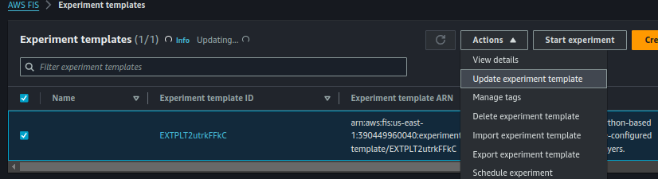
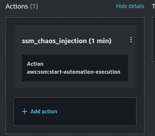

This project copied from [AWS' demo project](https://github.com/aws-samples/chaosinjection-lambda-samples) and modified to use Terraform and apply changes to a specified group of Python-based lambdas.


# Chaos Injection for Python Lambdas
Uses AWS Fault Injection Simulator (FIS) to create experiments that inject disruptions into lambda applications. It introduces random disruptinos such as an increase in response times (latency) and random failures. It can be applied to one or more Python-based lambdas.

Compatible versions:
- Python 3.8
- Python 3.9
- Python 3.10
- Python 3.11
- Python 3.12

This sample creates an FIS experiment that uses Lambda layers to inject disruptions. The Lambda layer contains the fault injection tooling. It is invoked prior to invocation of the Lambda function and injects random latencies or error. Injecting random latency simulates real world unpredictable conditions. The FIS experiment configures the Lambda function to use the fault injection layer using an AWS System Manager Document using an aws:ssm:start-automation-execution action. Once the experiment is complete, another AWS System Manager document rolls back the layer’s attachment to the Lambda function. This design allows for the chaos experiment to be used for existing serverless applications, without changing the existing Lambda function. 

The Lambda function’s handler is replaced with the handler of the respective layers by the FIS aws:ssm:start-automation-execution action. The automation changes the Lambda function handler to a function in the layer. The layer function has the logic to inject chaos. At runtime, the layer function is invoked, injecting chaos in the Lambda. The layer function then invokes the original Lambda function’s handler, so that original functionality is fulfilled. 

The result is invocation of original Lambda function with latency or error injected. The observed changes are random latency or failure, which are logged.


# Dependencies
- Terraform

# Instructions
## Deployment
1. Clone the repo.
2. To deploy, run the publish.sh script.
```./publish.sh```

## Apply Experiment
1. In AWS FIS console, select the created experiment template, then select 'Actions' > 'Update experiment template'. \

2. Select the ssm_chaos_injection action box to open the 'Edit action' form. \

3. Update the 'Document parameters' box with a json dictionary listing the lambda functions you want to test with. Here is the format: ```{"LambdaList":["lambda_function_name_1","lambda_function_name_2"]}``` Each lambda MUST be a python lambda of compatible version (listed above). Save changes.
4. Start experiment with the template, wait until state changes to "Completed". 


## Test Application
At this stage, all elements are in place to inject chaos into your Lambda functions. Whenever they are invoked there is a moderate chance that there will be an injected delay or an injected failure.


## To roll back the experiment
Navigate to the Systems Manager Console, go to documents menu option then 'Owned by me' tab and locate the document called "RollbackChaosForPythonLambdaGroups".

Click on the document, and click on Execute Automation. Click on Execute. This rolls back the Lambda function to the state before chaos injection. 

## Cleanup
To avoid incurring future charges, delete all resources.
```
cd terraform
terraform destroy
```
